## 操作系统基本原理

### 操作系统

#### 作用

​	操作系统是用来管理计算机的软硬件资源的。如果没有操作系统，用户不能和计算机资源进行交互，即操**作系统是人和计算机的接口**。比如Windows、Linux就是人和计算机的接口，通过操作可视化界面与计算机交互。

​	另一方面，**应用软件和硬件之间也有API接口**，应用软件在调取计算机资源时，可直接调取操作系统专为应用软件提供的接口，来实现相关业务功能。

#### 职能

- 进程管理：管理进程的生命周期（进程的状态、前趋图、PV操作、思索问题）
- 存储管理：管理软件资源在硬盘的存储（段页式存储、页面置换算法）
- 文件管理：管理操作系统的文件（索引文件，位示图）
- 设备管理：管理计算机硬件和软件的联系
- 作业管理：管理进程的作业功能
- 微内核操作系统（虚设备与SPOOLING技术）

### 进程管理

#### 进程三态

​	在操作系统中，运行了大量进程，进程有自己的生命周期，也就是我们所说的状态。

##### 三态模型

​	进程状态可分为`等待态`、`就绪态`、`运行态`

- 运行态：某进程需要的所有资源已经具备，且拿到了CPU资源
- 就绪态：某进程需要的所有资源已经具备，但还没拿到CPU资源
- 等待态：某进程除了CPU资源外，还缺其他资源

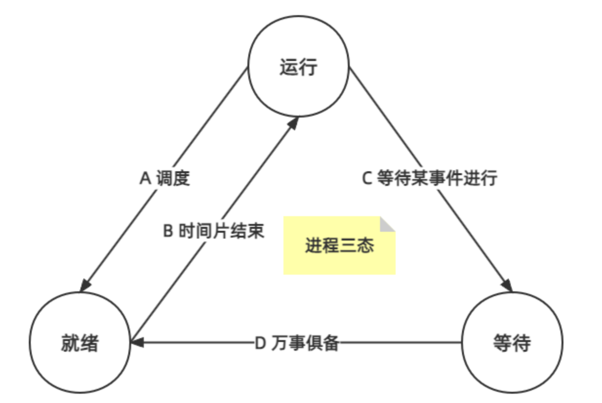

A：进入运行状态后，运行到一般时间片到期了，就会被停止，重新排队，目的是为了防止一个大进程持续消耗CPU资源，造成堵塞

B：就绪的进程，接到了CPU的调度指令，开始运行

C：运行中的进程，缺少了资源会由运行状态转为等待态，如缺少用户指令等（这里要注意，这个进程就算后面又拿到了资源，也是走D操作，即从心进入就绪态，重新排队等待CPU的调度，无法从等待态直接回到运行态）

D：等待中的进程，除了CPU之外的全部资源都已经俱全

##### 五态模型

​	三态模型应用比较成熟后，发现这三种状态已经不能涵盖常见的所有情况，比如计算机用户强制暂停某个进程，这就不能用三态解释，于是这个时候，推出了五态模型。

​	五态模型包括了：**运行态(三态运行态)、活跃就绪态(三态就绪态)、活跃阻塞态(三态等待态)、静止就绪态、静止等待态**

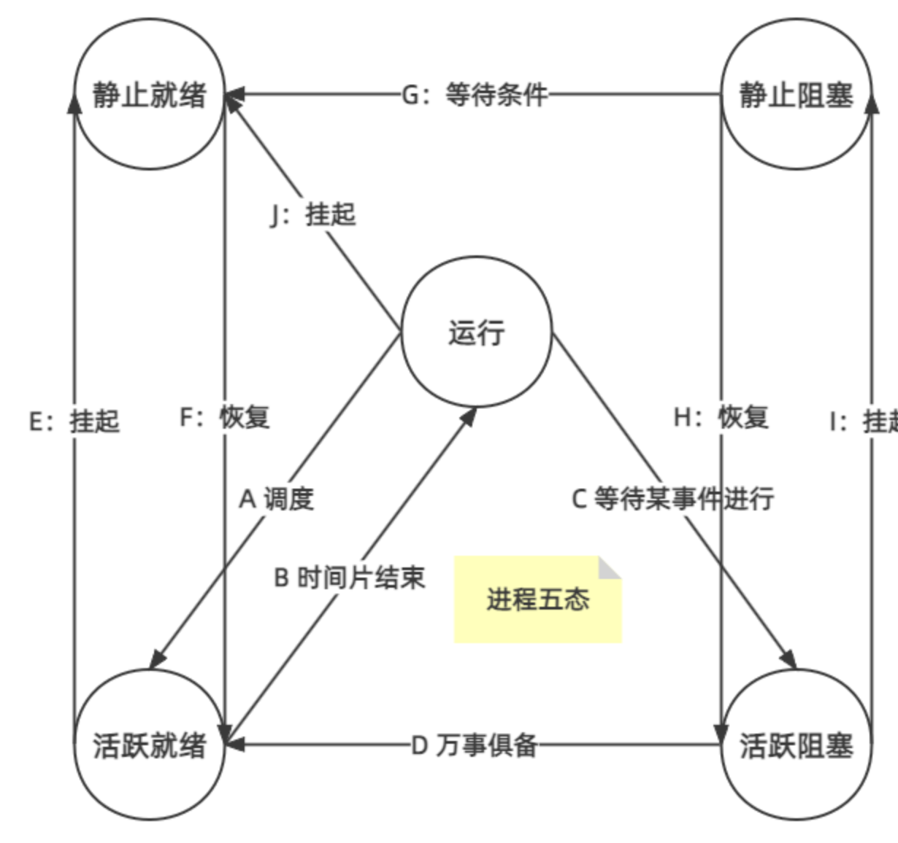

​	如果说用户正在听音乐，中途接了个电话，于是停止播放音乐去接电话，这个停止操作就是上图J（挂起）步骤，接完电话后重新播放音乐，则走F（恢复）步骤，由静止就绪态 转换为活跃就绪态，等待CPU调度，而不是直接打到运行态。

#### 前趋图

​	前趋图是用来描述进程运行先后顺序的有向无循环图，可以表达一系列活动它的先后的约束关系。

​	简单来说，就是描述一个程序中，**必须先做什么，后面才能做什么；或者是哪些可以一起做**。

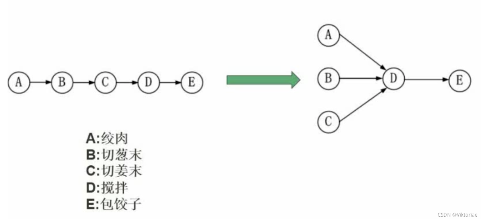

如上图，先执行ABC，才能执行D，最后才能执行E。

#### 进程的同步与互斥

互斥：在同一时刻，只允许一个进程去使用资源，即同一个资源不能同时服务于多个进程

同步：当差距拉得较大时，要求速度快的停下来等

`互斥的反义词是共享，同步的反义词是异步`

#### 消费者模型

​	在多线程系统中，生产者就是造出数据的线程，消费者就是消费数据的进程，如果生产者造数据很快但消费者处理很慢，就会造成服务器内存爆满，或硬盘不够的情况，反之，会造成消费者进程资源浪费，于是衍生了`生产消费者模型`。

​	`生产消费者模型`是一个典型的多线程并发协作模型，在分布式系统中很常见，它包括了生产者、消费者和缓冲区。

​	生产者：生产数据，并把数据放入缓冲区队列中

​	消费者：从缓冲区中取出数据，然后消费

​	缓冲区：用于存放生产者数据

​	根据缓冲区的数据量，该模型还可以分成单缓冲区和多缓冲区模型。

##### 单缓冲区消费者模型

​	把缓冲区看作一个盒子，同个时间片智能一个人放入或取出资源，不能同时进行多个操作，这个盒子是互斥资源。

​	当生产者将资源放入盒子，需要等待消费者取出后才能再次放入，这个过程是同步(即需要停下来等别人的过程)。

##### 多缓冲区消费者模型

​	多缓冲区同理，多个缓冲区作为一个大盒子，只允许一个人放入或取出，不能同时操作，这个大盒子是互斥资源。

​	大盒子资源放满后，生产者需要取出任意多个资源后，才可以继续放入，这是同步的过程。

#### PV操作

​	首先了解三个基本概念：临界资源、临界区、信号量。

- 临界资源(V(S))：多个进程需要共享使用的资源，如打印机
- 临界区(P(S))：各个进程访问临界资源的那一段代码
- 信号量(S)：被P操作或V操作所操控的变量

​	P(S) 操作，也就是P操作，可以将信号量S减1，如果S >= 0 则进程继续，若S < 0，进程进入等待队列，变为等待状态。

​	V(S) 操作，也就是V操作，可以将信号量S加1，如果S > 0, 则进程继续，若 S <= 0，从等待队列释放一个等待进程。

​	PV操作存在的意义就是实现不同进程之间的同步和互斥。

##### PV操作原则

​	P操作相当于请求资源、输入，V操作相当于释放资源、输出

##### 单一进程内部，由P操作到V操作

```
- P: 请求资源(程序输入)
- 执行....
- V: 释放资源(程序输出)
```

##### 两个进程之间，由V操作到P操作

```
- V: 一个进程释放了资源
- P: 另一个进程申请该资源
```

> 👆 一些技巧：
>
> 初始进程只有V没有P
>
> 终止进程只有P没有V
>
> 进程内从P到V
>
> 进程间从V到P

##### PV + 前趋图

​	前趋图中信号排序规则：从左到右，从上到下

###### 例题

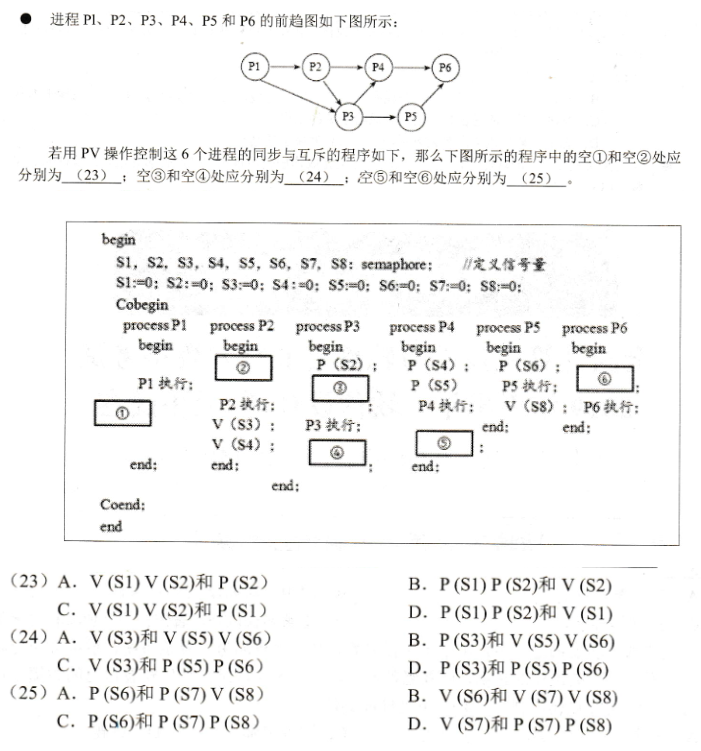

- 首先根据上面的技巧，将前趋图的信号量标出来

  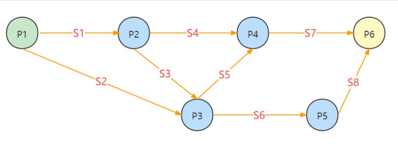

- 然后根据每个进程的输入输出情况得：

```
// 初始进程只有V没有P
P1: V(S1) V(S2)
// 进程间先V后P
P2: P(S1) V(S3) V(S4)
P3: P(S2) P(S3) V(S5) v(S6)
P4: P(S4) P(S5) V(S7)
P5: P(S6) V(S7)
// 终止进程只有P没有V
P6: P(S7) P(S8)
```

- 于是得到:


#### 死锁问题

​	操作系统中最核心的业务，就是对进程进行管理，尽可能照顾进程之间的同步和互斥关系，如果进程管理不当，就会造成死锁问题。

​	所谓进程发生死锁，就是指这个**进程正在等待一件不可能发生的事情发生**，如果一个或多个进程发生死锁，就可以认为整套系统发生了死锁。

##### 发生条件

- 进程互斥：存在互斥资源，如果各进程可以同步执行，就不会发生死锁
- 有保持的等待关系：即存在线程A因某原因，等待进程B得情况
- 系统不剥夺进程资源：即进程在执行的过程中，操作系统不强制去剥夺进程当前拥有的资源，等到进程执行完成后再回收进程资源
- 形成环路等待：进程之间的等待依赖形成了一个环路

##### 死锁资源计算

​	软考常见考题：已知若干进程需要的资源，求至少分配多少资源才不会发生死锁问题。

​	比如：一套业务系统一共有四个进程，分别为A、B、C、D，这四个进程都需要6份资源，求系统至少需要多少份资源，才不会发生死锁问题。

​	计算公式：`(进程需要资源数 - 1) * 进程数 + 1`

​	解决这个问题的思路就是假设出现最坏的情况，四个进程都占用了5份资源，这时，只要系统还剩一份资源给任意一个进程，就可以让这个进程成功执行，进程执行后把资源释放，系统再分配给其它进程执行，这样就不会出现死锁的问题。所以这题的答案是21。

##### 银行家算法

​	系统发生死锁很正常，因此我们需要主动预防死锁，即进行有序的资源分配，`银行家算法`是最具代表性的避免死锁的算法。

​	之所以叫这个名字，是因为该算法的逻辑类似于银行放贷的逻辑，尽可能避免坏账的出现。

​	银行家算法的逻辑：

- 不负荷执行：一个进程的最大需求量不超过系统拥有的总资源数，才会被执行
- 可分期：一个进程可以分期请求资源，但总请求数不可超过最大需求量
- 推迟分配：当系统现有资源数小于进程需求时，对进程的需求可以延迟分配，但总让进程在有限时间内获取资源

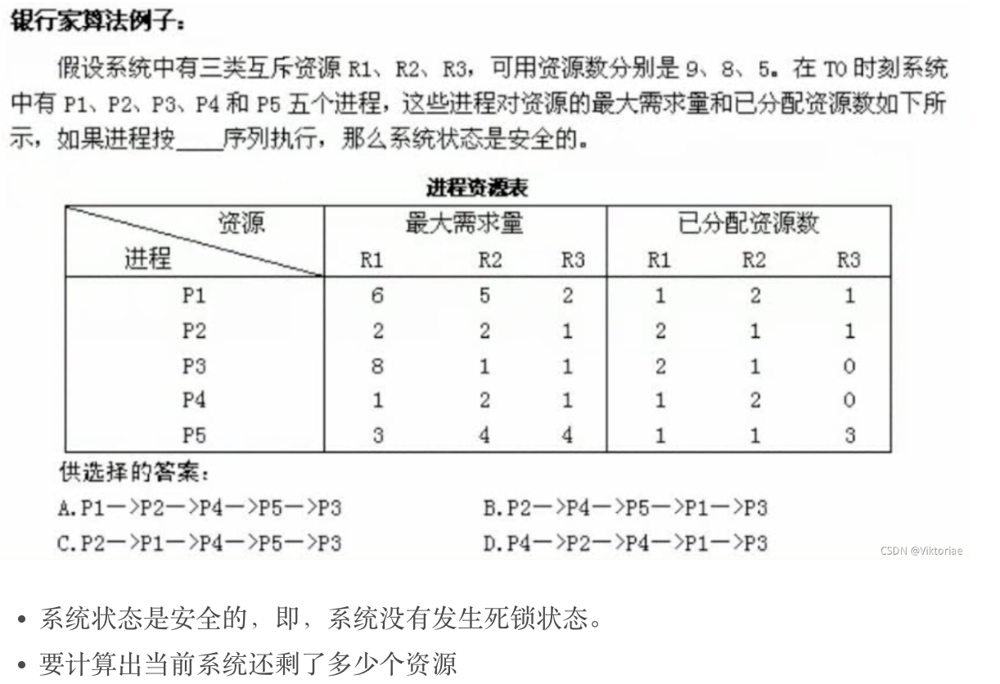

大概过程就是，算出每个进程剩余需求量，还有系统资源的剩余量，看剩下的还能 满足谁就谁先执行，执行完之后要把释放的资源再记入系统资源剩余量中，继续按此逻辑推下去。

### 存储管理

#### 进程存储

​	进程数据存储是操作系统中很重要的部分。

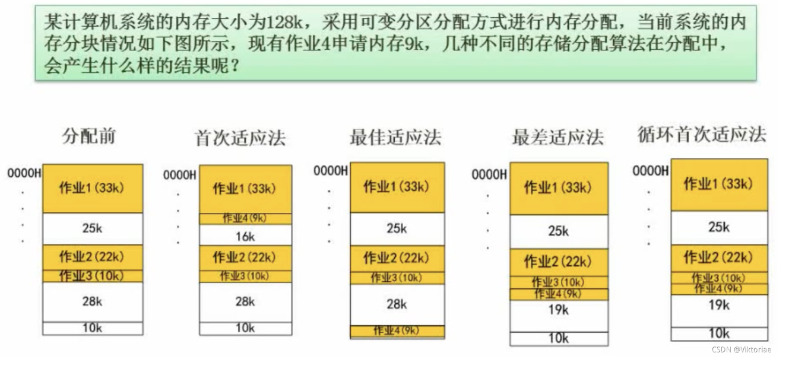

##### 首次适应法

​	就是从上到下找到第一个能放的内存卡直接放下。

##### 最佳适应法

​	遍历所有现有内存块，找到能满足的最小内存块。

##### 最差适应法

​	跟前面相反，遍历所有现有内存块，找到能满足的最大内存块。

##### 循环首次适应法

​	将当前空闲的内存块从上到下，按顺序连成一个环状，然后顺次分配，再每次遍历最先可放的空闲块，直接放。

#### 页式存储管理

##### 原理

​	高级程序语言在设计时使用逻辑地址，但在运行时需要用物理地址在内存中寻找，这就涉及到**逻辑地址和物理地址的转换**问题。

​	页式存储是把计算机的存储器划分成**大小相等**的多个区域，每个区域称为一块，并对它们按照顺序编号。

> 物理地址 = 块号 * 块长 + 页内地址

程序的逻辑地址是将内存划分为多块相同大小的页，同样按顺序编号。

​	在分页式存储模式中，允许将每一页分散存储在物理块中，要求程序能在内存中找到每个页面所对应的物理块，确保作业的正确运行。物理地址的块是真实存在的，而逻辑地址是人们在编程时拟定的，所以有一个关联表，即页表。

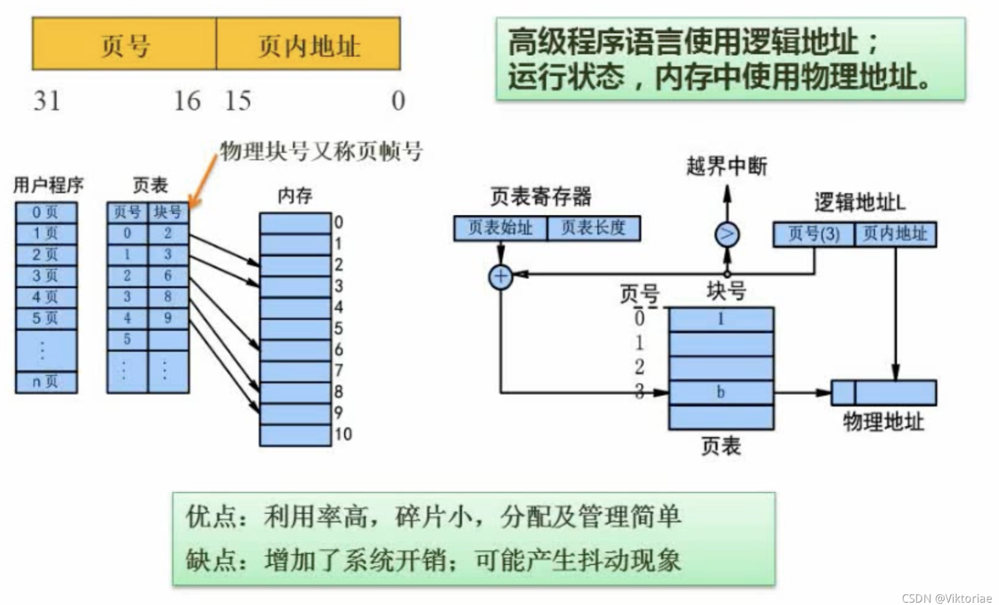

​	使用`页式存储`，比如每一页设定为4K大小，运行一个需要503K内存的程序，只要为其分配126页即可，剩下浪费的1K可以忽略不计，也就是**利用率高、碎片小**。

​	通过固定页大小，取址计算可通过乘法计算，**分配和管理比较简单**。

​	但页式存储需要实时维护页表，**增加了系统开销**。

​	使用页式存储可能会**出现抖动现象**，即内存给予越多，缺页率反而增加

​	总体而言，页式存储的逻辑如下：

- 将进程虚拟空间划分为长度相等的多个页，按顺序编号
- 将内存空间划分为多个存储块(物理块)，和页一样大，按顺序编号
- 为进程分配内存时，以块为单位，根据页表匹配，将若干页分别装入可以不相邻的物理块中

##### 逻辑地址和物理地址转换

​	页式存储地址由页号(P) 和页内地址(W)组成，物理地址由块号(页帧号)和页内地址组成。因此，在进行转换时，只需要根据页表，将页号替换为块号即可，而后面的页内地址无需变动。

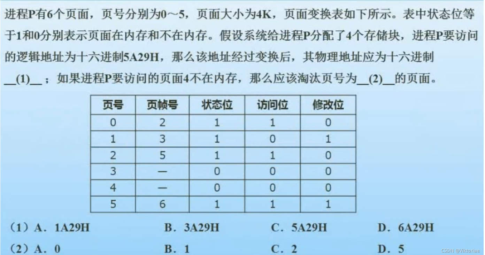

​	页面大小4K，4K = 2 ^ 12，可得页内地址是12位，而逻辑地址是5A29H，转换为二进制就是0110, 1010, 0010, 1001，后面12位(1010,0010,1001)就是页内地址，所以0110就是页号，通过查表克制页帧号也就是块号为6，于是就得物理地址应该是 6A29H。淘汰页号，淘汰的必须是在内存中的、且访问位不能为刚刚访问过的，因此这里淘汰的是页面1。

#### 段式存储管理

​	简单来说，段式存储管理是将页式存储管理的页大小设置为不固定。因为程序一般是由主进程、子进程、堆栈等元素组成，每一段都有自己独立的作用，所以将一段作为单位存储在内存中也是一种很好的方式，称为`段式存储`。

​	在段式存储中，每个作业都由独立段组成，可以给段做个编号，即逻辑地址从0开始编号，段内地址是连续的，段和段之间是不连续的，所以，段式存储的逻辑地址有段号和段内地址组成。

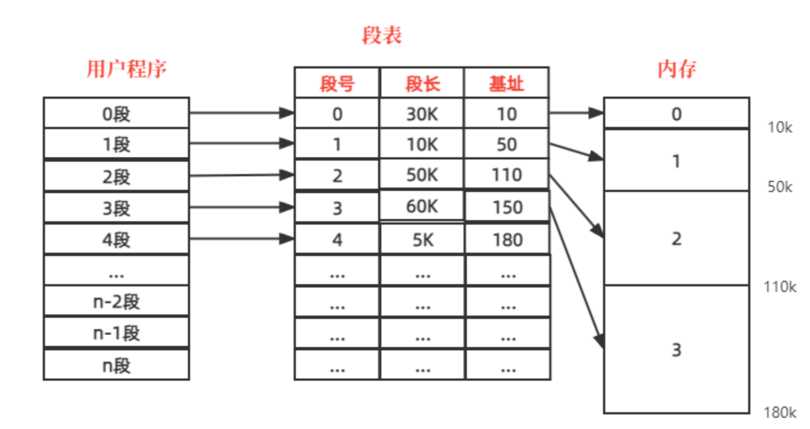

​	优点：多个程序可共享内存，而且读写互不影响

​	缺点：内存利用率低，碎片大

#### 段页式存储管理

​	段页式存储管理结合了页式存储和段式存储的方法，采用了分段的方式，每一段作业独立编程，再把段分成若干个页面，相当于在段式的基础上套了一层页式存储，结构如下：


​	优点：利用率高、物理地址连续存储

​	缺点： 需要实时维护段页表，增加系统开销，执行速度下降

#### 快表

​	一种高速缓存（Cache）组成的小容量存储器，特点是速度快，并且可以从硬件上保证按内容并行查找，一般用来存放当前访问最频繁的少数活动页面的页号。

#### 页面置换算法

​	在计算机的存储结构中存在局部性原理，意为如果一个数据正在被使用，那么近期它很可能会被再次使用。因此，高速缓存（Cache）的存在非常必要，它虽容量小，但速度快，可以极大地提高执行效率。

​	使用高速缓存后，CPU首先到高速缓存中尝试获取数据，拿到了数据就直接返回，如果没拿到，则发生了缺页现象，再到主存去取数据。

​	在高速缓存放满后，又有新数据进来时，就要涉及页面置换算法了，也就是把现有的某个数据淘汰掉，给新入的数据留地方，页面置换算法使用不当，会发生抖动现象。

​	常见的页面置换算法有：`最优算法`、`随机算法`、`先进先出算法`、`最近最少用算法`。其中`最优算法`只是一个理论算法，通常用于事后去人为分析最优的算法，这类算法的意义时分析其它算法的优劣性，评估某个算法距离最优算法还差多远，没有实际求解意义。而`随机算法`是一个计算机模拟算法，采用随机的方式进行页面淘汰，具有较大的不确定性，也没有太大的求解意义。

##### 先进先出算法

​	顾名思义，先进来的先出去，这种算法可能出现抖动现象。

​	列题：对于 1 2 3 4 4 4 3 2 1 4 5 3 2 2 5 1 序列，进程内存空间为 3 位，开始内存为空，使用先进先出算法，计算缺页次数。

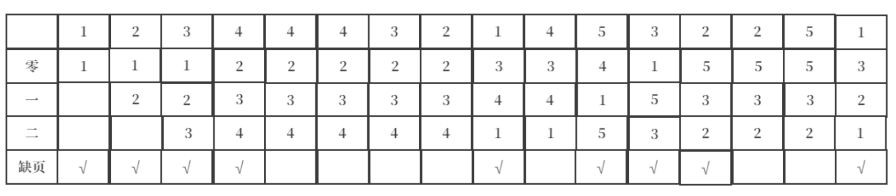

​	画出上表内存空间位与数据序列的关系，得出缺页次数为9次。

##### 最近最少使用算法

​	最近最少使用算法是每次淘汰最低频率使用的数据，这种算法不会出现抖动现象。

​	还是基于上面的例题，得出：

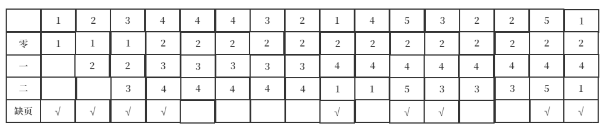

​	例题2: 

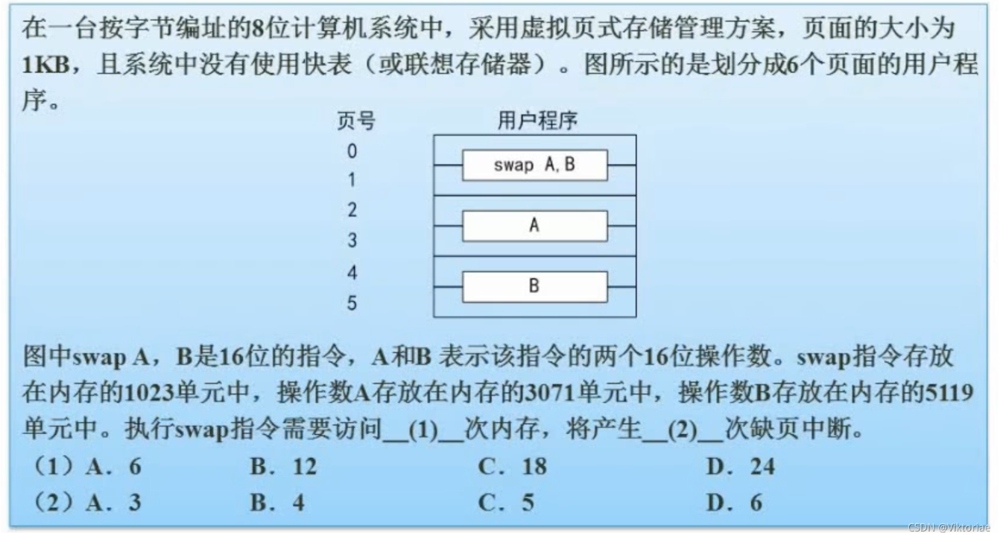

没有使用快表，即每个块需要访问两次内存，因此执行swap指令需要访问12次内存，默认指令一次性读入即只产生一次缺页，操作数每个会产生两次，因此会产生5次缺页中断。