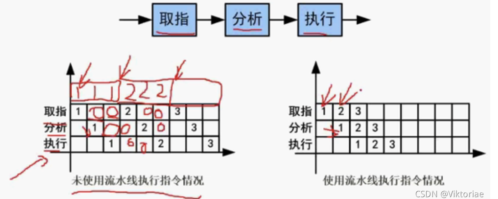
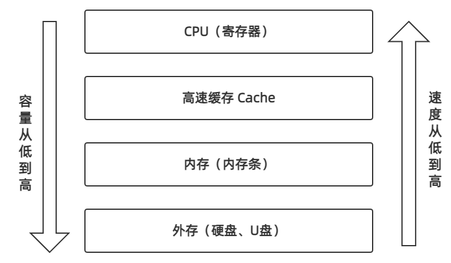
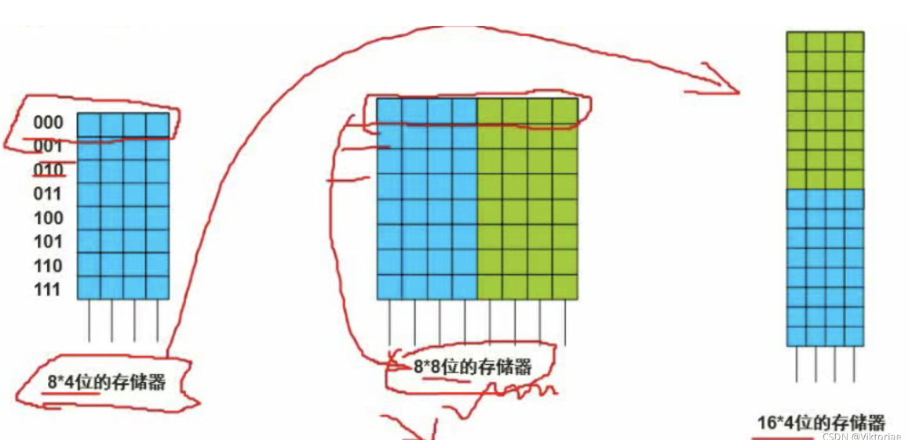
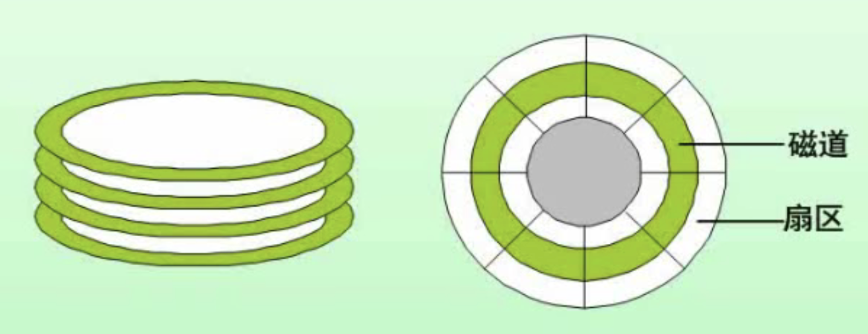
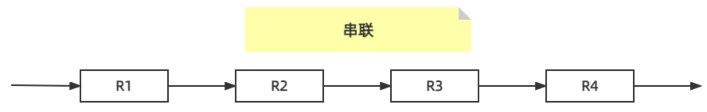
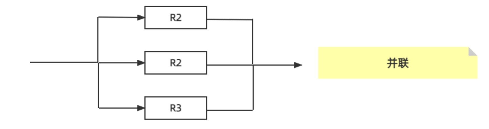
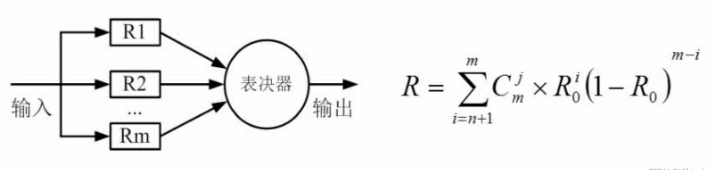
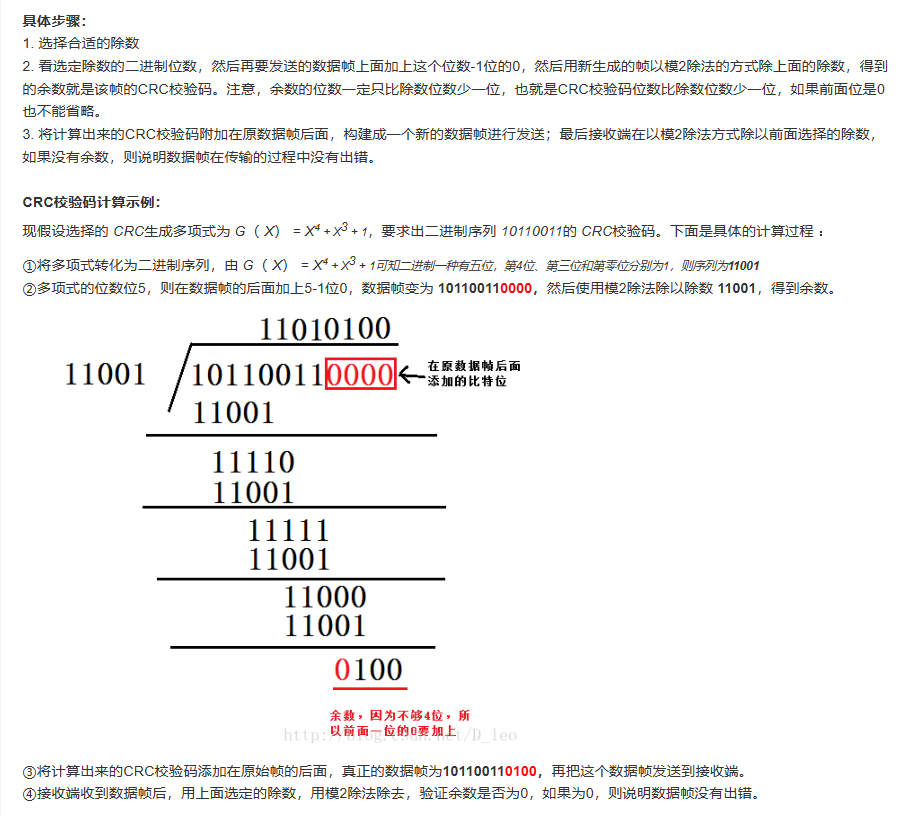

### 计算机结构

#### 主机的结构

​	主机 = `CPU` + `主存储器（内存）`

##### CPU

​	CPU的核心组件是 `运算器 ` 和 `控制器`，别的重要的组件还有寄存器、高速缓存和总线。

###### 	运算器

-  `算术逻辑单元(ALU, Arithmetic and Logic Unit)`
-  `累加寄存器(AC，Accumulator register)`
-  `数据缓冲寄存器(DR，Data Register)`
-  `状态条件寄存器(PSW, Program Status Word)`

###### 	控制器

- `程序计数器(PC，Program counter)`
- `指令寄存器(IR，Instruction register)`
- `指令译码器(ID，Instruction decoder)`
- `时序部件`

##### 指令执行的过程


##### 寄存器

​	CPU的寄存器可以分为几类：

- 控制器寄存器：位于控制器，比如说指令寄存器IR、程序计数器PC
- 运算器寄存器：位于运算器，比如说数据寄存器DR、标志寄存器FR
- 通用寄存器：用于存储临时数据和地址，在CPU整个执行过程中都可以被使用，通常分布在控制器、运算器的寄存器部分，方便数据的传输和操作，不同的CPU架构会有不同数量和命名的通用寄存器。
- 特殊寄存器：具有特殊的功能和用途，比如栈指针寄存器、索引寄存器之类的。

​	有几个重要的寄存器需要记住：

- 地址寄存器(AR, Adress Register): 保存当前CPU访问的内存单元的地址，由于内存和CPU之间存在操作速度上的差别，所以必须使用地址寄存器来保持地址信息，知道内存的读写操作完成为止。
- 程序计数器(PC, Program Counter): 为了保证程序指令能够连续地执行下去，CPU必须具有某些手段来确定下一条指令的地址，而程序计数器就是起到这样的作用，所以它又叫指令计数器。

#### Flynn分类法（大概知道就行了）

​	这是一种计算机体系结构的分类法。

​	主要有两个指标：指令流和数据流，都分成两种：单的和多的，组成了四种体系结构。

|     体系结构类型      |                        结构                        |               关键特性               |                        代表                        |
| :-------------------: | :------------------------------------------------: | :----------------------------------: | :------------------------------------------------: |
| 单指令流单数据流 SISD | 控制部分： 一个<br />处理器： 一个<br />主存：一个 |                                      |                单处理系统（单片机）                |
| 单指令流多数据流 SIMD |  控制部分：一个<br />处理器：多个<br />主存：多个  |  各处理器以异步的形式执行同一条指令  |   并行处理器<br />矩阵处理器<br />超级向量处理机   |
| 多指令流单数据流 MISD | 控制部分： 多个<br />处理器： 一个<br />主存：多个 |     被证明不可能，至少是不实际的     |       目前没有，有文献认为流水线计算机为此类       |
| 多指令流多数据流 MIMD | 控制部分： 多个<br />处理器： 多个<br />主存：多个 | 能实现作业、任务、指令等各级全面并行 | 多处理机系统、多计算机<br />（现代计算机属于这类） |

#### CISC & RISC

​	这两个是指令系统类型：

| 指令系统类型 | 指令                                                         | 寻址方式   | 实现方式                                             | 其它                       |
| :----------- | :----------------------------------------------------------- | ---------- | ---------------------------------------------------- | -------------------------- |
| CISC (复杂)  | 数量多，使用频率差别大，可变长格式                           | 支持多种   | 微码（微程序控制技术）                               | 研制周期长                 |
| RISC(精简)   | 数量少，使用频率接近，定长格式，大部分为单周期指令，操作寄存器，只有Load/Store操作内存 | 支持方式少 | 增加了通用寄存器，硬布线逻辑控制为主，适合采用流水线 | 优化编译，有效支持高级语言 |

​	CISC ：是以前计算机还没有大规模通用化时提出的（那时候计算机是定制的），比如说天气预报计算机。根据不同用户做不同的指令，而且指令数量多且复杂。

​	RISC ：后来计算机称为通用设备，对计算机指令系统进行了精简化，比如说把乘法删掉，利用多个加法来实现乘法，这样可以大大减少系统的指令数量。RISC还引入了通用寄存器，速度极快效率极高。

​	可变长格式：指令系统里面有一个二进制的编码，编码的长度可以不同，而在RISC中是定长格式。

​	硬布线逻辑控制：效率高，缺点是一旦设计完成后无法修改，需要重新设计和实现硬件电路才可改变。

#### 流水线

​	一般我们执行一条指令，大抵需要三个步骤：取址(A)、分析(B)、执行(C)。

​	如果我们不采取流水线执行指令，那连续进行指令操作的时候，就是ABC、ABC....，由于取址、分析、执行三个步骤是由三个不同的部件来完成的，按照这种方式来看，完成第一轮的A之后，就开始执行B，此时A的部件处于空闲状态，直到下一轮A开始，这样造成了极大的浪费，如果使用流水线，则在完成第一轮A之后，立马开始第二轮A，这样效率就大大提高了。



##### 流水线周期

​	流水线周期指的是，流水线执行过程中，**最长的一段执行时间**。

> 举个例子，如果一条指令取址需要3ns、分析需要4ns、执行需要1ns，那么这个流水线周期就是4ns。

##### 流水线执行时间计算

​	流水线计算公式为：1条指令执行时间 + （指令条数 - 1）* 流水线周期

​	k 是一条指令的工序数量，n 是指令执行的次数，Δt 是流水线周期

- `理论公式`：(t1 + t2 + t3 + .... + tk) + (n-1) * Δt  
- `实践公式`：(k + n-1) * Δt

​	我们沿用上面引用中的例子，如果这个有100条指令需要执行，取址3ns、分析4ns、执行1ns，那么使用流水线后执行时间是多少？

​	首先我们确定的是，流水线周期是4ns。

​	使用理论公式：(3 + 4 +1) + (100 - 1) * 4 = 404

​	使用实践公式: (3 + 100 - 1) * 4 = 408

​	但是在软考中，我们**优先使用理论公式**，如果没有理论公式的答案，再选实践公式。

##### 流水线吞吐率

​	流水线的吞吐率，是指**单位实践内，流水线完成的指令数量**。

​	也就是说，`吞吐率 = 指令条数 / 流水线执行时间`。

​	对于流水线最前最后的资源浪费，只要流水线够长就可以忽略不计，所以还有一个最大吞吐率的概念：`最大吞吐率 = 1 / 流水线周期`。

​	继续沿用上述例子，流水线的吞吐率 = 100 / 404， 最大吞吐率 = 1 / 4

##### 流水线的加速比

​	不同的流水线会给生产带来不同的加速比例，所以有 `流水线加速比`的概念，计算公式： `流水线加速比 = 不使用流水线执行时间 / 使用流水线执行时间`

​	如果不使用流水线，则执行所有指令使用的时间 = (3 + 4 + 1) * 100 = 800

​	而使用流水线执行时间是404，所以流水线加速比为 800 / 404

##### 流水线效率

​	`流水线效率 = 被占用的时空格 / 总的时空格`

​	`被占用的时空格 = 一个指令的执行时间 * 指令的数量 (不使用流水线执行时间)`

​	`总的时空格 = 指令工序数 * 指令全部执行时间 (执行时间 * 一个指令的工序数)`

​	上例中的流水线效率 = ( (3 + 4 + 1) * 100 ) / (3 * 404) = 800 / 1212

#### 计算机存储结构

​	计算机的存储结构包括了CPU的`寄存器`，用于**临时缓存指令数据**，还有`高速缓存Cache`、`内存`、`外存`。



- 寄存器：CPU的寄存器一般在运算器和控制器中，作为一个临时缓存，一般寄存器的容量只有1-64KB大小
- 高速缓存：又称Cache，速度在寄存器和内存之间，CPU的寄存器在取指令时，会先到Cache中查询，有则返回，没有再到内存中读取(工作于CPU和内存之间)，Cache的存在可以加快CPU的执行效率，一般以MB为计量单位
- 内存：计算机的运行内存，现代计算机内存容量一般在4G~32G之间
- 外存：计算机系统的外部存储设备，比如硬盘、U盘、光盘等，现代外存一般都是以TB为计量单位了

##### Cache 

- Cache能提高CPU数据输入输出的速率，突破冯诺伊曼瓶颈，即CPU与存储系统间数据传送带宽限制
- 在计算机存储系统体系中，Cache是访问速度最快的层次（Cache按内容存取，速度远高于按地址）
- 使用Cache改善系统性能的依据是程序的局部性原理（简单来说，将20%常用的指令放在Cache中，可以达到80%的效果）
- 影响Cache命中率的因素包括高速存储器的容量、存储单元组的大小、组数多少、地址联想比较法、替换算法、写操作处理方法和程序特性等，这些因素互相影响，没有关键影响因素

##### 局部性原理

###### 时间局部性

​	意味着最近执行的指令有很高的再次执行的机会。因此，指令被保存在高速缓存中，以便可以轻松获取它并切无需花费时间来搜索相同的指令。

###### 空间局部性

​	意味着所有存储在最近执行的指令附近的指令都有很高的执行机会， 它是指使用存储位置相对较近的数据元素（指令）。

##### 系统运行周期计算

​	假设Cache的命中率为X，不用Cache（没有命中）的周期时间为A，用了Cache（命中）的周期为B，那么使用`Cache + 内存模式`的系统平均周期为多少？

​	计算公式： 系统平均周期 = X * A + （1 - X）* B

​	假设Cache的命中率为95%，不用Cache（没有命中）的周期时间是50纳秒，用了Cache（命中）的周期时间是9纳秒，那么使用Cache + 内存模式的系统平均周期为多少？

​	系统平均周期 = 0.95 * 9 + 0.05 * 50 = 11.05 (纳秒)

#### 随机存储器 & 只读存储器

​	主存分为两类，`随机存取存储器` 和 `只读存储器`。

​	`随机存取存储器`又分为静态和动态，静态SRAM，动态DRAM， 它的特点是以单断电，内存中所有的数据都将被清除，保存不下来。

​	`只读存储器`包括磁盘，但不包括固态硬盘，在掉电之后，仍然能存储相应信息。

##### 主存的编址



-  把芯片组成相应的存储器
- 8 * 4 位就是：8 代表它有8个地址空间，4代表每个地址空间是存储4个bit位的信息，比如000这一个空间里面就有4个bit的容量

主存模块主要考察地址单元的计算，公式：`地址单元 = 尾地址 - 首地址 + 1`。

​	比如内存首地址是2，尾地址是18，那么这块内存包含了 18 - 2 + 1 = 17 个地址单元。

​	但题目一般是16进制，比如内存地址从AC000H到C7FFFH，求共有多少个地址单元？

```
尾地址先+1: C7FFFH + 1 = C8000H
 C8000H
-AC000H
--------
=1C000H

转十进制：
(1 * 16 ^ 3) + (12 * 16 ^ 2) = 65536 + 49152 = 114688
114688 / 1024 = 112K
```

​	所以该内存一共有112K个地址单元，如果该内存地址按字(16bit)编址，由28片存储器芯片构成，已知每片芯片有16K个存储单元，则每块芯片的每个存储单元存储几位？

```
112K * 16 = 28 * 16 * 存储单元位数(x)
即存储单元位数(x) = 112K * 16 / 28 / 16K = 4 bit
```

#### 磁盘工作原理



​	在对磁盘的数据进行一次存储时，需要消耗一定的时间，我们称为`磁盘存取时间`

​	磁盘存取时间又有两个部分：

- `寻道时间`: 磁头移动到磁道所需要的时间
- `等待时间`: 等待扇区转到磁道所用的时间

​	在360°的磁道上，必定有一个`磁头`，可以理解为一个数组的首元素指针

###### 磁盘的存取时间计算

题目：假设某磁盘的每个磁道划分为11个物理块，每块存放一个逻辑记录。逻辑记录R0，R1...R10存放在同一个磁道上，如果磁盘的旋转周期为33ms，磁头当前处在R0的开始处，若系统使用单缓冲区顺序处理这些记录，每个记录处理时间3ms，则处理这11个记录的最长时间为( )，若对信息存储进行优化分布后，处理11个记录的最少时间为( )

```
旋转周期33ms，一共11块，则每次读一个需要3ms，读完之后还需要处理3ms
第一问：正在缓冲区处理的时候磁头跑到R2开始处了，最长时间顺序处理，肯定是读完R0读R1，结果跑到R2去了，又要等一个周期旋转到R1开始处(10 * 3 + 读取3 + 处理3) = 36ms, 再加上之前处理R0的6ms，最终是36 * 10 + 6 = 366ms(因为一开始就在R0，R0不需要一的周期旋转等待时间)
第二问：优化分布之后，就隔一个位置放一个，比如说把R1放在原来R2的位置，这样就可以在处理完R0之后，直接读取处理R1，这样算的话，时间就是6 * 11 = 66ms
```

#### 计算机总线

- 内部总线: 寄存器和寄存器之间的连接、芯片内部的连接、寄存器和运算器/控制器之间的连接
- 系统总线: CPU、内存之间的连接

- 外部总线: 主机和鼠标、键盘、麦克风等外部设备的连接

系统总线又包括`数据总线`、`地址总线`、`控制总线`

- 数据总线：双向传输，与机器字长、存储字长有关
- 地址总线：单项传输，与存储地址、I/O地址有关
- 控制总线：用于发出信号(存储器读、存储器写、总线允许、中断确认等操作)、接收信号（中断请求、总线请求等操作）

##### 系统可靠性计算

​	系统可靠性需要区分串联和并联，有不同计算公式。

###### 	串联



​	设N个系统的可靠性为R，则这个串联系统的可靠性为R1 * R2 * R3 * R4

​	计算公式：R1 * R2 * .... * Rn

​	误差率公式为：(1-R1) * (1-R2) * (1-R3) * ... * (1-Rn)，仅供参考，误差率较大

###### 	并联



​	设N个系统的可靠性为R，则这个并联系统的可靠性为：R = 1 - (1-R2)(1-R2)(1-R3)

​	计算公式：R = 1 - (1-R1)(1-R2)...(1-Rn)

###### 	模冗余模型



- 提高系统可靠性时可以用冗余的方式进行。表决器中少数服从多数

#### 差错控制

##### 检错

​	从接收的报文中，**检查出错误**

###### 纠错

​	从接收的报文中**检查出错误，并改正错误**，一般通过加冗余信息(增大码距)来实现

###### 码距

​	码距是整个编码系统中任意两个码字的最小距离。

​	比如说，一个编码A和任意和A不一样的编码B，最少需要变更的位数。

​	如果从一个合法编码A到另一个合法编码B，最少需要变动两位，则码距是2

​	**码距越大，排错能力越好**

```
例1：采用1位长度的二进制编码，A = 0, B = 1, 则A和B之间的码距是1，因为从0变到1最少需要变动1位

如果张三给李四发送一串编码0，但李四接收到的编码是1，那么李四则无法识别接收到的编码是否正确，因为张三发送的0和李四接收的1，都是合法的编码
```

```
例2: 若采用 2 位长度的二进制编码，设 A = 00，B = 11，那么 A、B 之间的码距是 2，因为从 00 变到 11 最少需要变 2 位。

如果张三给李四发送了一串编码 00，但李四接收到的编码是 01，那么李四可以确定接受的编码错了，因为只有 00 和 11 是合法的字符，而 01 不合法，但李四无法确定张三发送的到底是 00 还是 11 ，所以只知道错误，但不能纠错。
```

```
例3: 若采用 3 位长度的二进制编码，设 A = 000，B = 111，那么 A、B 之间的码距是 3，因为从 000 变到 111 最少需要变 3 位。

如果张三给李四发送了一串编码 000，但李四接收到的编码是 001，那么李四可以确定接受的编码错了，因为只有 000 和 111 是合法的字符，而 001 不合法，但李四可以认为接收到的编码就是 000 ，因为李四潜移默化的认为计算机出错概率很小，所以这种情况下知道错误，也能纠错。
```

###### 码距和检错、纠错的关系

​	在一个码组内，为了检测e个误码，要求最小码距d应该满足：d >= e + 1

​	在一个码组内，为了纠正t个误码，要求最小码距d应该满足：d >= 2t + 1

#### 循环校验码CRC

​	CRC是可以做检错，单不能做纠错的一种编码。

​	在进行信息编码时，在数据尾部添加一串校验位，让编码后的数据和生成多项式相除且余数为零，如果接收方校验时，发现余数不为零，则代表传输过程中出现了错误。

(简单说就是用原始数据通过生成多项式来生成一串冗余信息填充在原始数据尾部，接收方收到数据后再用同样的方式去验证，如果余数0就是没有被篡改，如果不是0就是被篡改了)

​	CRC在计算中采用模二除法，即异或除法。



#### 海明校验码


海明校验码是一种可以检错纠错的校验码。

上面是常出的例题，计算要注意的是：

- 记住公式`m + k <= 2 ^k - 1`，m是信息的长度，k是海明码的长度，我们一般利用给出的信息码来求这个校验码的长度，这里k = 3
- 根据 m = 4, k = 3，可以得知加上校验码后信息长度应该为7，然后根据这个长度可以知道，校验位应该在2^0 = 1、2 ^ 1 = 2、2 ^ 2 = 4 这三个位置
- 然后就可以画出一个表格，用H来代表校验码，按顺序来看是：H1、H2、1、H3、1、0、1，要注意的是，信息码的顺序和校验码的顺序是反过来的
- 然后我们可以知道，信息码的位置在3、5、6、7，然后列矩阵：011、101、110、111，得 H3 = 1 xor 0 xor 1 = 0, H2 = 1 xor 0 xor 1 = 0, H1 = 1 xor 1 xor 1 = 1
- 补充表格中的顺序应该为，1、0、1、0、1、0、1，反过来写，加上校验位的数据应该是1010101
- 若接收到的信息是：1011101，则跟上面一样画表，然后**分别计算校验位和对应匹配的数据位的异或值即可，结果不为0，则说明这部分数据有错，如果当且仅当只有一个校验位不为0，说明只是校验位接收错误，数据位正确，无需更改**，比如这里：和H3匹配的数据应该是5、6、7位，1(H3) xor 1(7) xor 0(6) xor 1(5)   = 1，同样计算H2异或得0，H1异或得0，所以得到，只有H2位接收错误，直接取反即可，可回到数据1010101

#### 寻址方式

- 立即寻址：立即寻址方式只针对源操作数，此时源操作数是一个立即数，它作为指令的一部份，紧跟在指令的操作码之后，存放于内存的代码段中
- 直接寻址：直接寻址表示参加运算的数据放在内存中，指令中给出的是数据存放的偏移地址
- 寄存器寻址：当操作数不存放在内存中，而是放在CPU的通用寄存器中时，可采用寄存器寻址方式，此时指令给出的操作数地址不是内存的地址单元号，而是通用寄存器的编号
- 隐含寻址：有些指令的操作码不仅包含了操作的性质